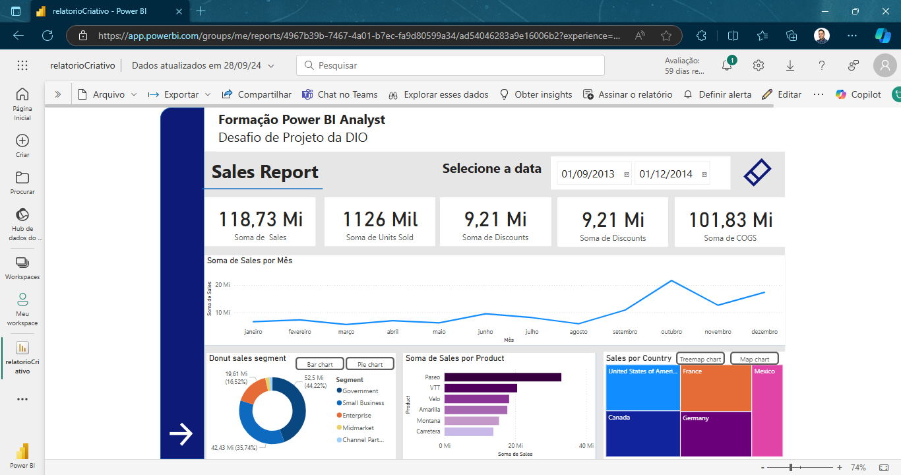
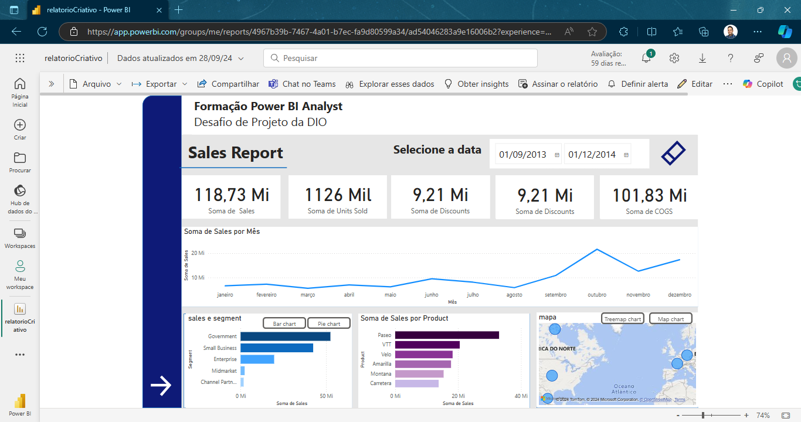
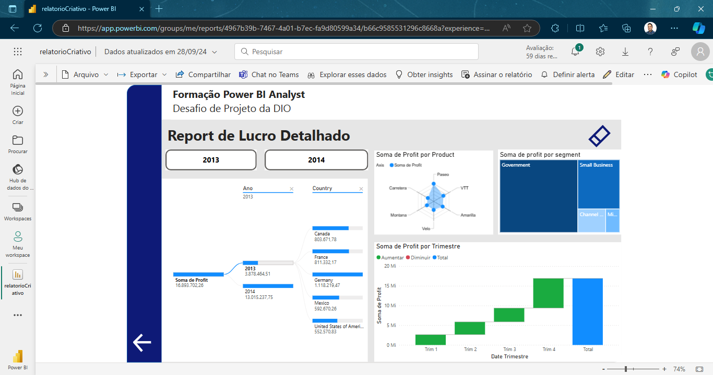
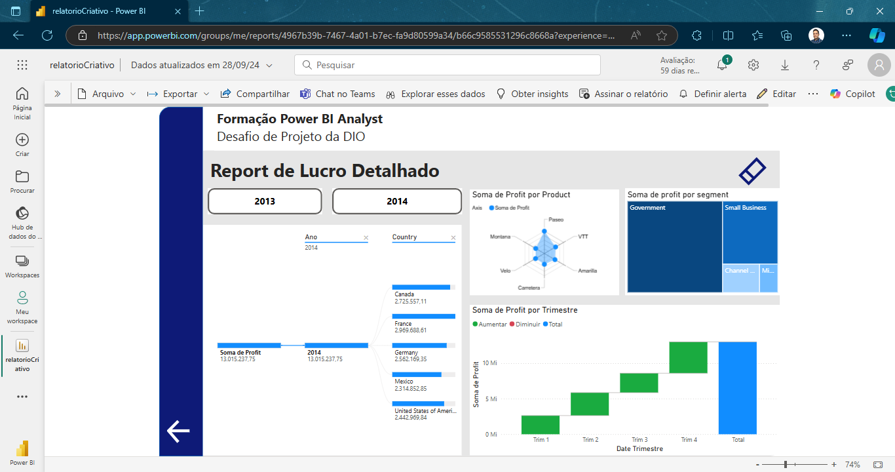

# Relatório Power BI: Análise de Vendas e Lucro

Este repositório contém a entrega de um relatório do Power BI, desenvolvido como parte do desafio final do curso de Power BI da **DIO** oferecido pela **NTTData**. O relatório foi construído e publicado utilizando o **Power BI Serviço** e contém diversas visualizações de vendas e lucro, organizadas em duas páginas.

## Descrição do Desafio

O desafio consistiu em criar um relatório com as seguintes características:

- **Página 1**: Foco na análise de vendas por segmento e por país, utilizando gráficos variados para destacar diferentes perspectivas.
- **Página 2**: Análise detalhada do lucro anual para os anos de 2013 e 2014.

Abaixo estão os prints das páginas do relatório, com diferentes tipos de gráficos utilizados para a visualização dos dados.

## Páginas do Relatório

### Página 1

#### Visualizações:
- **Gráfico de Donut**: Exibindo as vendas por segmento.
- **Treemap**: Exibindo as vendas por país.

#### Visualizações Alternativas:
- **Gráfico de Barra Horizontal**: Exibindo as vendas por segmento.
- **Mapa de Bolhas**: Exibindo as vendas por país.

### Página 2

#### Visualizações:
- **Lucro Detalhado em 2013**: Gráfico detalhado das análises de lucro por segmento e país no ano de 2013.

- **Lucro Detalhado em 2014**: Gráfico detalhado das análises de lucro por segmento e país no ano de 2014.

## Conclusão

Este relatório resume as vendas e lucros em diferentes anos e segmentos, utilizando uma variedade de visualizações para destacar diferentes aspectos dos dados. A entrega deste relatório conclui o desafio do curso de Power BI, demonstrando as habilidades de criação de gráficos, análise de dados e utilização de recursos do Power BI Serviço.
